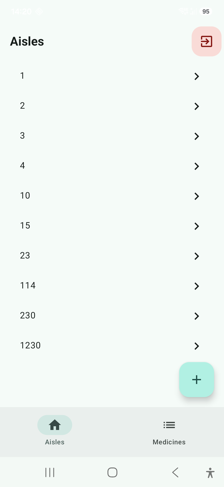
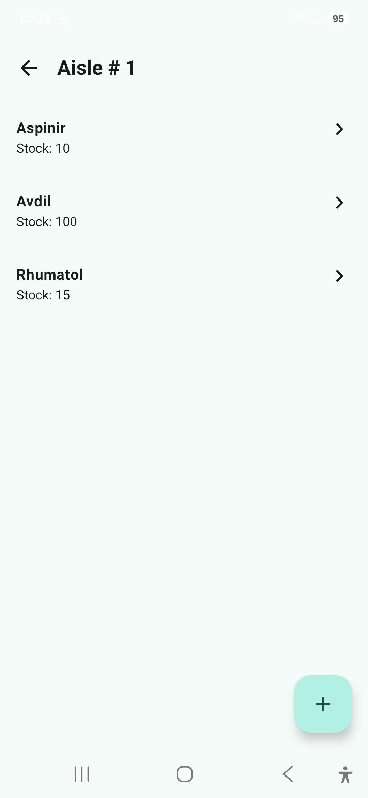
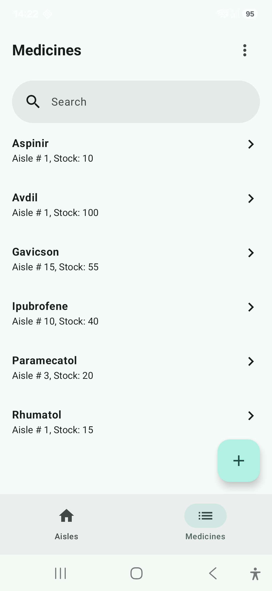
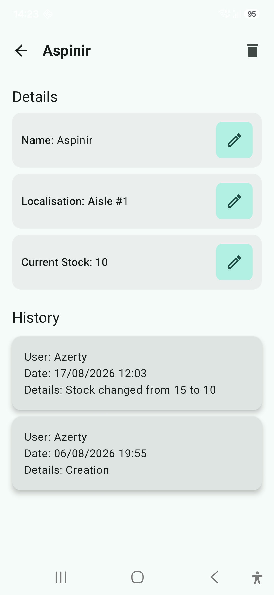

# Rebonnte

Rebonnte is an Android application designed for the supply chain of the Rebonnte company. It allows users to track medicines, their stock levels, and their locations (aisles) with a history of changes.

## Features

- **Inventory Management**: Keep track of medicines, stock levels, and storage aisles.
- **Aisle Organization**: Browse medicines by their specific aisle numbers.
- **Change History**: Comprehensive logging of all inventory updates (name, stock, or location changes).
- **Authentication**: Secure access using Firebase Authentication.
- **Cloud Sync**: Real-time data synchronization with Firebase Firestore.
- **Archiving**: Ability to archive medicines no longer in use.

## Tech Stack

- **Language**: Kotlin
- **UI Framework**: Jetpack Compose
- **Dependency Injection**: Koin
- **Backend**: Firebase (Firestore, Auth)
- **Architecture**: Clean Architecture (Domain, Data, UI) with MVVM pattern.

## Quality & Testing

- **Testing**: JUnit 5, MockK
- **Code Coverage**: Jacoco integration
- **Static Analysis**: SonarCloud integration

## Getting Started

1. Clone the repository.
2. Add your `google-services.json` to the `app/` directory.
3. Configure your Firebase project for Authentication and Firestore.
4. Build and run the app.

## Screenshots

| Aisles List | Aisle Detail |
| :---: | :---: |
|  |  |

| Medicines List | Medicine Detail |
| :---: | :---: |
|  |  |
---
*Developed as part of the OpenClassrooms Android Developer Program.*
